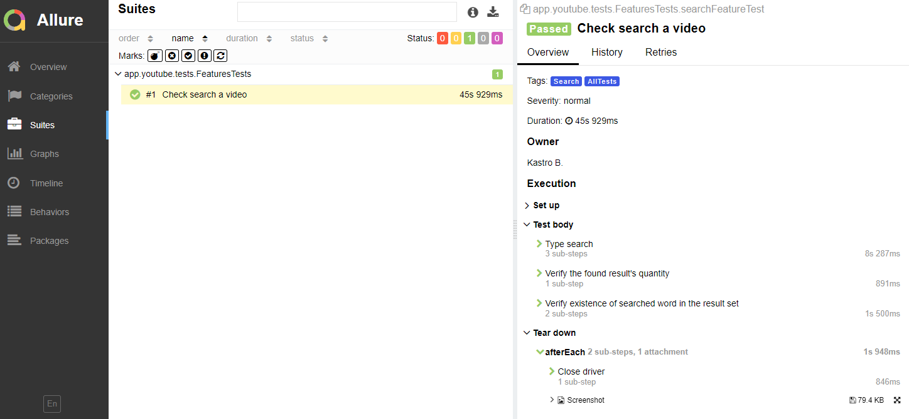

# Project to automate testing the app youtube in a physical telephone Samsung A10

## Content

* <a href="#link-technologies-and-tools">Technologies and tools</a>
* <a href="#link-implemented-tests">Implemented tests</a>
* <a href="#link-starting-test">Starting test </a>
## Technologies and tools

<p align="center">


</p>

In this project, autotests are written in Java using Appium and Selenide.

JUnit 5 is used as a unit testing library.

Gradle is used to build the project automatically.

Selenide is used instead appium for interaction with app.

Selenoid launches browsers in Docker containers.

Allure Report generates a test run report.

Jenkins is running tests.

After the run is completed, notifications are sent using the bot in Telegram.

## Implemented tests
- [x] Testing the Search functionality and checking for existence of results
- [x] Testing the Open video functionality and checking if the videos contain the researched word
- [x] Testing the Notifications functionality

## Starting test
<details>
<summary>Starting test from Idea console</summary>

### Starting tests Locally

* ```gradle clean test -DtestTag=${TAGTEST} allureServe```
* ```gradle clean test -DtestTag=Search allureServe```
* ```gradle clean test -DtestTag=Open allureServe```
* ```gradle clean test -DtestTag=Notifications allureServe```
* ```gradle clean test allureServe```
</details>

#### After passing the tests, the result is displayed in Allure Report

##  Example of Allure Report

## Allure report for each UI test includes a screenshot and log

<p></p>

### Please don't forget click on Star button ;)

